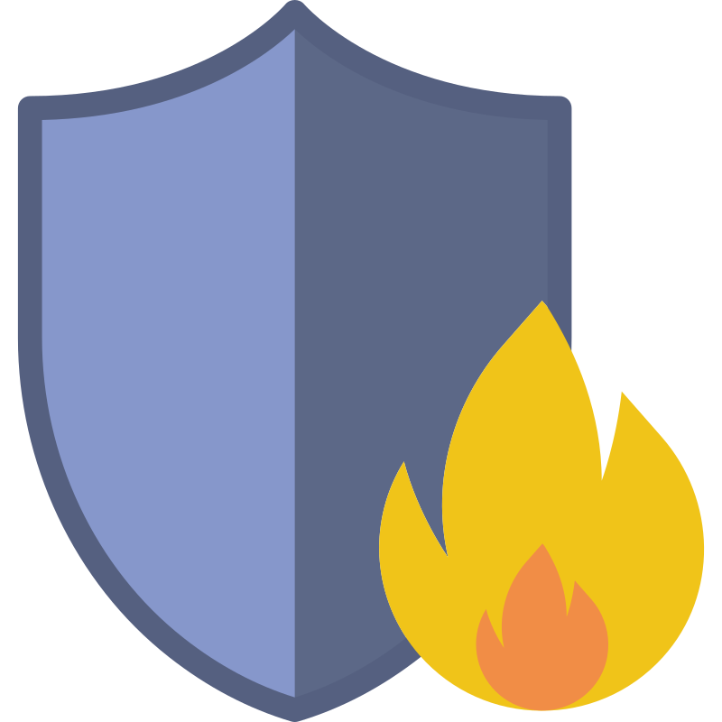

<div align="center">
	
	<h1>鲲擎安全态势感知（前端）</h1>
</div>

## Introduction

## Features

## Version
- v0.1 2024-06-07

## Documentation

## Usage

**Environment Preparation**

Make sure your environment meets the following requirements:

- **git**: you need git to clone and manage project versions.
- **NodeJS**: >=18.0.0, recommended 18.19.0 or higher.
- **pnpm**: >= 8.0.0, recommended 8.14.0 or higher.

**Install Dependencies**

```bash
pnpm i
```
> Since this project uses the pnpm monorepo management method, please do not use npm or yarn to install dependencies.

**Start Project**

```bash
pnpm dev
```

**Build Project**

```bash
pnpm build
```

## Development
Frontend is based on [`SoybeanAdmin`](https://github.com/soybeanjs/soybean-admin).

## Communication
